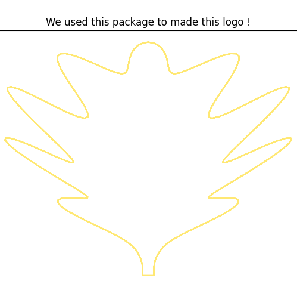

Python oak leaf drawer
----------------------
Python package making you able to draw OAK Leaf depending on an angle.

##### Dependency
The first step is using composer to install the package and automatically update your composer.json file, you can do this by running:

```shell

pip install python-oak-leaf-drawer

```

Usage
-----------


Examples:
----------


Changelog
---------
Please see the [CHANGELOG](https://github.com/syrian-open-source/python-oak-leaf-drawer/blob/master/CHANGELOG.md) for more information about what has changed or updated or added recently.

Security
--------
If you discover any security related issues, please email them first to "your email", 
if we do not fix it within a short period of time please open a new issue describing your problem. 

Credits
-------
* [Karam Mustafa](https://www.linkedin.com/in/karam2mustafa/)
* [All contributors](https://github.com/syrian-open-source/python-oak-leaf-drawer/graphs/contributors)
