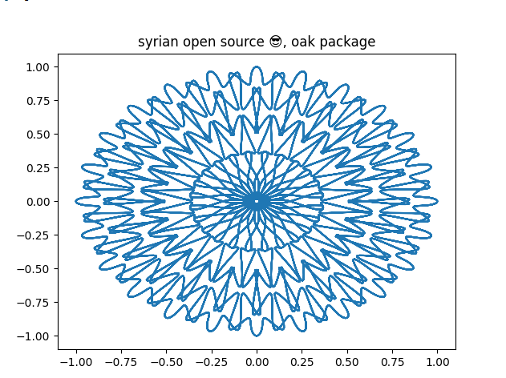
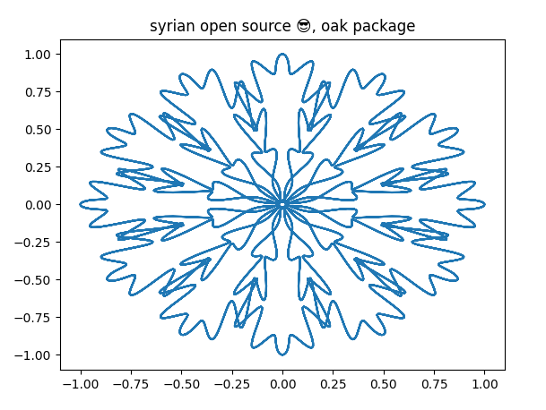
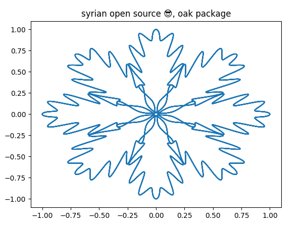

<p align="center">
  
</p>

Python oak leaf drawer
----------------------
Python package making you able to draw OAK Leaf depending on an angle.

##### Dependency
The first step is using composer to install the package and automatically update your composer.json file, you can do this by running:

```shell

pip install python-oak-leaf-drawer

```

Usage
-----------
```
from python_oak_leaf_drawer.oak import drawPattern

# The first parameter is the rotation angle.
# The second parameter is the title.
drawPattern(15 , "syrian open source 😎, oak package")

```
Examples:
----------
```
drawPattern(15 , "syrian open source 😎, oak package")
```

```
drawPattern(30 , "syrian open source 😎, oak package")
```

```
drawPattern(45 , "syrian open source 😎, oak package")
```


Changelog
---------
Please see the [CHANGELOG](https://github.com/syrian-open-source/python-oak-leaf-drawer/blob/master/CHANGELOG.md) for more information about what has changed or updated or added recently.

Security
--------
If you discover any security related issues, please email them first to "karam2mustafa@gmail.com", 
if we do not fix it within a short period of time please open a new issue describing your problem. 

Credits
-------
* [Karam Mustafa](https://www.linkedin.com/in/karam2mustafa/)
* [All contributors](https://github.com/syrian-open-source/python-oak-leaf-drawer/graphs/contributors)

About Syrian Open Source
-------
The Syrian Open Source platform is the first platform on GitHub dedicated to bringing Syrian developers from different cultures and experiences together, to work on projects in different languages, tasks, and versions, and works to attract Syrian developers to contribute more under one platform to open source software, work on it, and issue it with high quality and advanced engineering features, which It stimulates the dissemination of the open-source concept in the Syrian software community, and also contributes to raising the efficiency of developers by working on distributed systems and teams.
